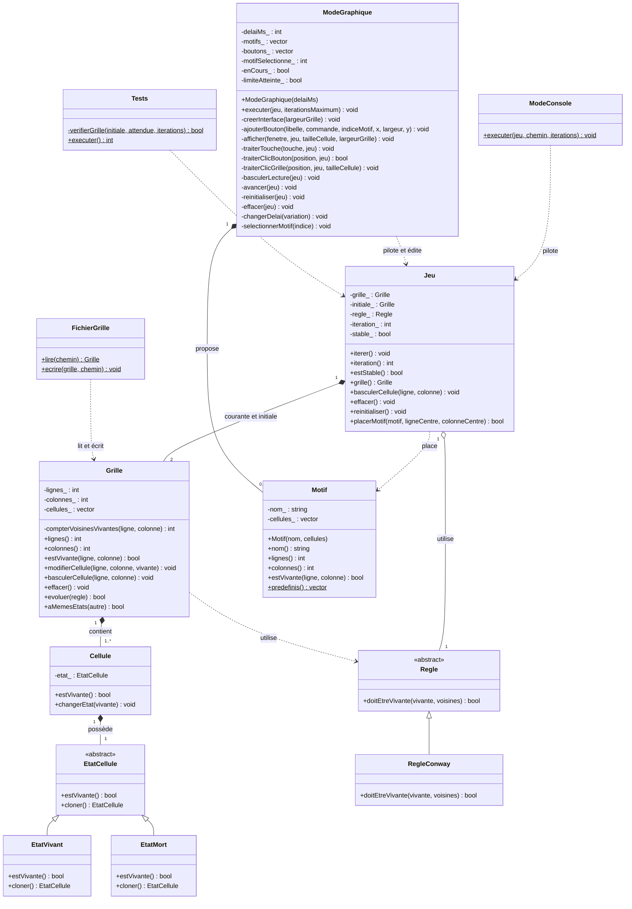
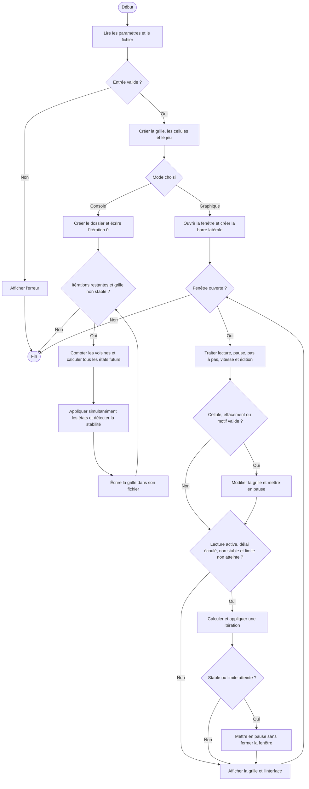
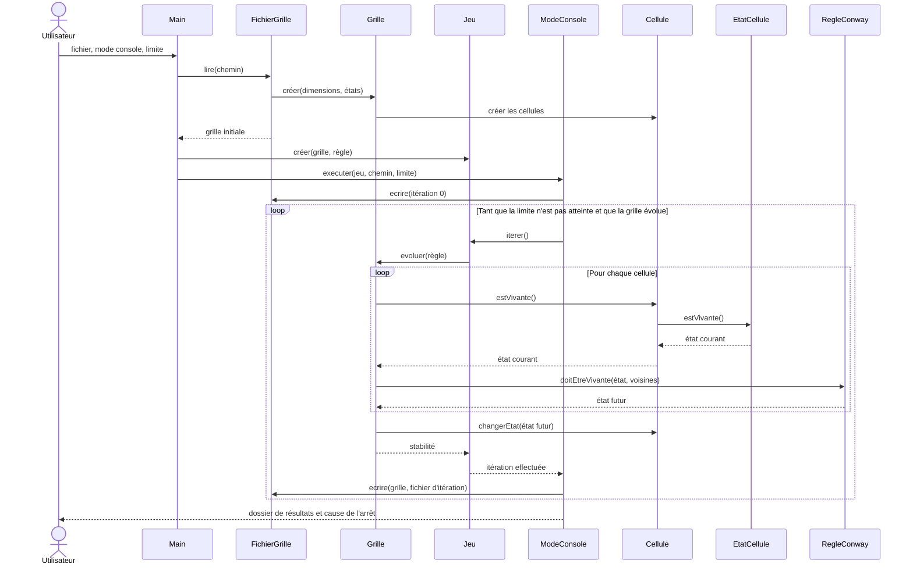

# Conception UML

## Diagramme de classes

```mermaid
classDiagram
    class Jeu {
        -grille_ : Grille
        -initiale_ : Grille
        -regle_ : Regle
        -iteration_ : int
        -stable_ : bool
        +iterer() void
        +iteration() int
        +estStable() bool
        +grille() Grille
        +basculerCellule(ligne, colonne) void
        +effacer() void
        +reinitialiser() void
        +placerMotif(motif, ligneCentre, colonneCentre) bool
    }
    class Grille {
        -lignes_ : int
        -colonnes_ : int
        -cellules_ : vector
        -compterVoisinesVivantes(ligne, colonne) int
        +lignes() int
        +colonnes() int
        +estVivante(ligne, colonne) bool
        +modifierCellule(ligne, colonne, vivante) void
        +basculerCellule(ligne, colonne) void
        +effacer() void
        +evoluer(regle) bool
        +aMemesEtats(autre) bool
    }
    class Motif {
        -nom_ : string
        -cellules_ : vector
        +Motif(nom, cellules)
        +nom() string
        +lignes() int
        +colonnes() int
        +estVivante(ligne, colonne) bool
        +predefinis()$ vector
    }
    class Cellule {
        -etat_ : EtatCellule
        +estVivante() bool
        +changerEtat(vivante) void
    }
    class EtatCellule {
        <<abstract>>
        +estVivante() bool
        +cloner() EtatCellule
    }
    class EtatVivant {
        +estVivante() bool
        +cloner() EtatCellule
    }
    class EtatMort {
        +estVivante() bool
        +cloner() EtatCellule
    }
    class Regle {
        <<abstract>>
        +doitEtreVivante(vivante, voisines) bool
    }
    class RegleConway {
        +doitEtreVivante(vivante, voisines) bool
    }
    class FichierGrille {
        +lire(chemin)$ Grille
        +ecrire(grille, chemin)$ void
    }
    class ModeConsole {
        +executer(jeu, chemin, iterations)$ void
    }
    class ModeGraphique {
        -delaiMs_ : int
        -motifs_ : vector
        -boutons_ : vector
        -motifSelectionne_ : int
        -enCours_ : bool
        -limiteAtteinte_ : bool
        +ModeGraphique(delaiMs)
        +executer(jeu, iterationsMaximum) void
        -creerInterface(largeurGrille) void
        -ajouterBouton(libelle, commande, indiceMotif, x, largeur, y) void
        -afficher(fenetre, jeu, tailleCellule, largeurGrille) void
        -traiterTouche(touche, jeu) void
        -traiterClicBouton(position, jeu) bool
        -traiterClicGrille(position, jeu, tailleCellule) void
        -basculerLecture(jeu) void
        -avancer(jeu) void
        -reinitialiser(jeu) void
        -effacer(jeu) void
        -changerDelai(variation) void
        -selectionnerMotif(indice) void
    }
    class Tests {
        -verifierGrille(initiale, attendue, iterations)$ bool
        +executer()$ int
    }

    Jeu "1" *-- "2" Grille : courante et initiale
    Jeu "1" o-- "1" Regle : utilise
    Jeu ..> Motif : place
    Grille "1" *-- "1..*" Cellule : contient
    Cellule "1" *-- "1" EtatCellule : possède
    EtatCellule <|-- EtatVivant
    EtatCellule <|-- EtatMort
    Regle <|-- RegleConway
    Grille ..> Regle : utilise
    FichierGrille ..> Grille : lit et écrit
    ModeConsole ..> Jeu : pilote
    ModeGraphique ..> Jeu : pilote et édite
    ModeGraphique "1" *-- "0..*" Motif : propose
    Tests ..> Jeu : vérifie
```

## Diagramme d'activité

```mermaid
flowchart TD
    A([Début]) --> B[Lire les paramètres et le fichier]
    B --> C{Entrée valide ?}
    C -- Non --> D[Afficher l'erreur]
    D --> Z([Fin])
    C -- Oui --> E[Créer la grille, les cellules et le jeu]
    E --> F{Mode choisi}
    F -- Console --> G[Créer le dossier et écrire l'itération 0]
    G --> I{Itérations restantes et grille non stable ?}
    I -- Non --> Z
    I -- Oui --> J[Compter les voisines et calculer tous les états futurs]
    J --> K[Appliquer simultanément les états et détecter la stabilité]
    K --> M[Écrire la grille dans son fichier]
    M --> I

    F -- Graphique --> H[Ouvrir la fenêtre et créer la barre latérale]
    H --> N{Fenêtre ouverte ?}
    N -- Non --> Z
    N -- Oui --> O[Traiter lecture, pause, pas à pas, vitesse et édition]
    O --> P{Cellule, effacement ou motif valide ?}
    P -- Oui --> Q[Modifier la grille et mettre en pause]
    P -- Non --> R{Lecture active, délai écoulé, non stable et limite non atteinte ?}
    Q --> R
    R -- Non --> V[Afficher la grille et l'interface]
    R -- Oui --> S[Calculer et appliquer une itération]
    S --> T{Stable ou limite atteinte ?}
    T -- Non --> V
    T -- Oui --> U[Mettre en pause sans fermer la fenêtre]
    U --> V
    V --> N
```

## Diagramme de séquence — une itération en mode console

```mermaid
sequenceDiagram
    actor Utilisateur
    participant Main
    participant Fichier as FichierGrille
    participant Grille
    participant Jeu
    participant Console as ModeConsole
    participant Cellule
    participant Etat as EtatCellule
    participant Regle as RegleConway

    Utilisateur->>Main: fichier, mode console, limite
    Main->>Fichier: lire(chemin)
    Fichier->>Grille: créer(dimensions, états)
    Grille->>Cellule: créer les cellules
    Fichier-->>Main: grille initiale
    Main->>Jeu: créer(grille, règle)
    Main->>Console: executer(jeu, chemin, limite)
    Console->>Fichier: ecrire(itération 0)
    loop Tant que la limite n'est pas atteinte et que la grille évolue
        Console->>Jeu: iterer()
        Jeu->>Grille: evoluer(règle)
        loop Pour chaque cellule
            Grille->>Cellule: estVivante()
            Cellule->>Etat: estVivante()
            Etat-->>Cellule: état courant
            Cellule-->>Grille: état courant
            Grille->>Regle: doitEtreVivante(état, voisines)
            Regle-->>Grille: état futur
        end
        Grille->>Cellule: changerEtat(état futur)
        Grille-->>Jeu: stabilité
        Jeu-->>Console: itération effectuée
        Console->>Fichier: ecrire(grille, fichier d'itération)
    end
    Console-->>Utilisateur: dossier de résultats et cause de l'arrêt
```
